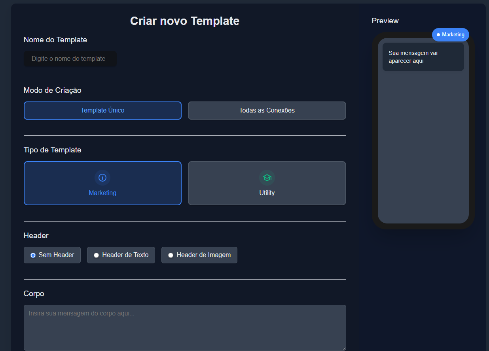

# Template Creator for WhatsApp Business

A desktop application built with Tauri, React, and TypeScript for creating and managing WhatsApp Business message templates through the GupShup API.



## Features

- **Template Creation**: Create WhatsApp templates for individual accounts or bulk create for all connections
- **Template Types**: Support for both Marketing and Utility template categories
- **Header Options**: Create templates with text headers, image headers, or no headers
- **GupShup Integration**: Direct integration with GupShup API for template submission
- **Preview**: Real-time preview of how templates will appear on WhatsApp
- **Variable Support**: Add personalization variables to your templates

## Tech Stack

- **Frontend**: React, TypeScript, CSS
- **Backend**: Rust with Tauri
- **Database**: PostgreSQL
- **API Integration**: GupShup WhatsApp Business API

## Installation

### Prerequisites

- [Node.js](https://nodejs.org/) (v16 or later)
- [Rust](https://www.rust-lang.org/tools/install)
- [Tauri CLI](https://tauri.app/v1/guides/getting-started/setup)

### Setup

1. Clone the repository:
   ```bash
   git clone https://github.com/yourusername/insert-templates.git
   cd insert-templates
   ```

2. Install dependencies:
   ```bash
   npm install
   ```

3. Create a `.env` file in the project root with the following variables:
   ```
   DB_URL=postgres:://username:password@host:port/database
   APIKEY=your_gupshup_api_key
   COOKIE=your_gupshup_session_cookie
   ```

4. Start the development server:
   ```bash
   npm run tauri dev
   ```

## Building for Production

To build the application for production:

```bash
npm run tauri build
```

The compiled application will be available in the `src-tauri/target/release` directory.

## Usage

### Creating a Template

1. Enter the template name
2. Select the creation mode (single or all connections)
3. Choose the template type (Marketing or Utility)
4. Configure the header (none, text, or image)
5. Enter the template content
6. Enter the App ID (if in single mode) and Vertical information
7. Click "Save Template" or "Create for All Connections"

### Variables

You can add variables to your templates using double curly braces syntax:

- `{{1}}`, `{{2}}`, etc. - These will be replaced with actual data when messages are sent

## Project Structure

- `/src` - React frontend code
  - `/pages` - React components for pages
  - `/styles` - CSS stylesheets
- `/src-tauri` - Rust backend code
  - `/src/api` - API integrations
  - `/src/config` - Configuration handling
  - `/src/database` - Database connection and queries

## Database Schema

The application connects to a PostgreSQL database with a `parametros` table containing connection information such as:

- `id` - Connection ID
- `source_name` - Name of the connection source
- `app_id` - GupShup App ID
- `facebook_id` - Facebook Business ID
- `facebook_token` - Facebook Business Token

## API Documentation

The application interacts with the GupShup API to:

- Upload media files for image templates
- Create text and image templates
- Create templates for multiple connections

GupShup API endpoints used:
- Template creation: `https://api.gupshup.io/wa/app/{app_id}/template`
- Media upload: `https://api.gupshup.io/wa/api/v1/app/{app_id}/media`

## Development

### Recommended IDE Setup

- [VS Code](https://code.visualstudio.com/) + [Tauri](https://marketplace.visualstudio.com/items?itemName=tauri-apps.tauri-vscode) + [rust-analyzer](https://marketplace.visualstudio.com/items?itemName=rust-lang.rust-analyzer)
